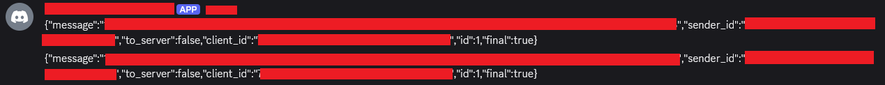
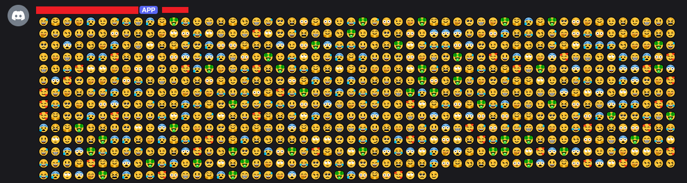

tl;dr: most 3rd party c2s send unencrypted routing data and use base64. I encrypted the routing data and added pluggable codecs to minimize the risk of detection. 

[https://github.com/TheKevinWang/discordx](https://github.com/TheKevinWang/discordx)

## the problem

So the discord profile sends unencrypted json with various routing fields, such as "to_server", "client_id", "message", etc. Both the 3rd party c2 admins and modern IDSs, EDRs should be able to detect this kind of signal. 

I remember back in the day, using the Empire dropbox listener, which used names like `<sessionID>_1.txt` for files. This resulted in dropbox accounts getting silently banned, which resulted in me being lazy and manually changing these values instead of fixing it for good (this was way before ai). 

## the solution

I now realize that this is a "metadata leakage caused by pre-decryption demultiplexing" problem, so I thought about potential solutions: take advantage of the capabilities offered by the 3rd party service, such as discord replies feature (neat but would not translate cleanly to other 3rd party c2 profiles), remove these fields and use some other way such as keeping track of messages, but that would result in a lot of bookkeeping and reliability issues for the agent and listener, or, encrypting the data, which I settled on as the most general and least invasive solution. This requires minimal additional code for the agent, since they usually already use encryption and encoding. The inner "mythic packet" is encrypted with a seperate key and potentially a different method, so that a captured payload does not reveal everything, just the routing data. 

I found C3 was one of the only 3rd party c2 that encrypt this data, but i didnt look that much. Mythic Slack C2's description "Encryption of channel messages" refers to the message payload not the routing envelope.

## random nonces

The nonce or IV that must be included unencrypted could be trackable if it increments. Therefore, like with C3, I made it an option to make this random as well, though it comes with a tiny collision risk for certain ciphers. 

## pluggable codecs

To further complicate detection, I also made it so that the transport encoding (how the final bytes are represented on the carrier, such as b64) is pluggable. This matches the behavior of some other C2s, such as sliver, and allows for custom codecs, such as with emojis (for fun 😂), but be careful of the overhead. Furthermore, with the whole message encoded, it doesnt have to be in json and have an encoded message payload, so I made it a raw frame.

## demo

What was this:

becomes this:

which decodes to this encrypted blob:
```
00000000: 26 2a eb 21 0e 6f 1b 07 69 02 47 36 3b 1f 23 ba  &*.!.o..i.G6;.#.
00000010: f6 6a 40 af 6e 6f 43 a6 b7 b0 c7 ac 9c c9 3c 79  .j@.noC.......<y
00000020: a5 31 50 b0 85 42 70 69 fb 64 73 bd dd ca 3e 71  .1P..Bpi.ds...>q
...
```

## detection

Detection shifts from exact content signatures toward anomalous service usage, such as a combination of timing, payload sizes, entropy, statistical analysis, etc. This still looks very different from normal discord usage. 

## further research

There is probably no single "best" third-party C2 design because the important goals compete with one another.

A useful comparison would evaluate communication designs across four dimensions:
- transport efficiency, including latency, bandwidth, expansion, and API limits;
- the agent's code size, complexity, dependencies, and endpoint-detection surface;
- how distinguishable the activity is from ordinary use of the third-party service;
- security properties such as confidentiality, integrity, replay protection, key isolation, and forward secrecy.

This leads to a broader question:

What would an optimal third-party C2 communication method look like if it had to balance transport efficiency, the agent's endpoint-detection surface, the detectability of its carrier activity, and strong cryptographic security?

More practically: where is the best tradeoff, and how should it change for different carriers, threat models, and operational requirements? 

